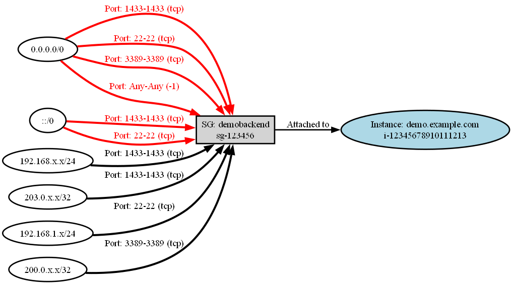

# EC2 Security Group Visualization

## Overview

This script fetches information about EC2 instances and their associated security groups from AWS and generates a visual representation of their security group relationships using Graphviz. Each EC2 instance's security settings are converted into a Graphviz DOT file and subsequently rendered as a PNG image.

## Features

- Fetches all security groups and their inbound rules.
- Fetches all EC2 instances and their associated security groups.
- Generates Graphviz diagrams for each instance showing security group relationships.
- Highlights open ports (0.0.0.0/0) in red for security awareness.

## Requirements

- AWS credentials configured (via `aws configure` or environment variables).
- Python 3.x installed.
- Required Python packages installed (`boto3` and `graphviz`).
- System Graphviz installed.

## Installation

### Step 1: Install Dependencies

Ensure you have the required Python packages installed:

```sh
pip install -r requirements.txt
```

### Step 2: Install Graphviz

#### Windows:

1. Download and install Graphviz from [Graphviz Official Site](https://graphviz.gitlab.io/download/).
2. Add Graphviz to system `PATH` (`C:\Program Files\Graphviz\bin`).
3. Restart your terminal.

#### Ubuntu/Debian:

```sh
sudo apt install graphviz
```

#### macOS:

```sh
brew install graphviz
```

### Step 3: Configure AWS Credentials

Ensure your AWS credentials are set up using:

```sh
aws configure
```

## Usage

Run the script:

```sh
python aws_security_visualization.py
```

It will generate Graphviz `.dot` files and corresponding `.png` images for each EC2 instance, representing its security group relationships.

## Output

- Each EC2 instance will have a corresponding `.dot` file (Graphviz format) and `.png` file (visual representation).
- Example file names:
  - `i-1234567890abcdef.dot`
  - `MyInstance_i-1234567890abcdef.png`
- The `.png` file visually represents:
  - **Instances** (Ellipses, light blue color)
  - **Security Groups** (Boxes, light gray color)
  - **Open Ports (0.0.0.0/0)** (Red arrows and labels)
  - **Inbound Rules** (Edges between nodes with port details)

## Example Output
Example visualization output: 


## Troubleshooting

- **Graphviz **``** command not found**:
  - Ensure Graphviz is installed and added to `PATH`.
  - Run `dot -V` to verify installation.
- **AWS credentials error**:
  - Ensure credentials are configured using `aws configure` or environment variables.
- **No output generated**:
  - Ensure the script has permission to describe instances and security groups in AWS.

## License

This project is licensed under the MIT License.

## Author

Shumaila Ahmed

